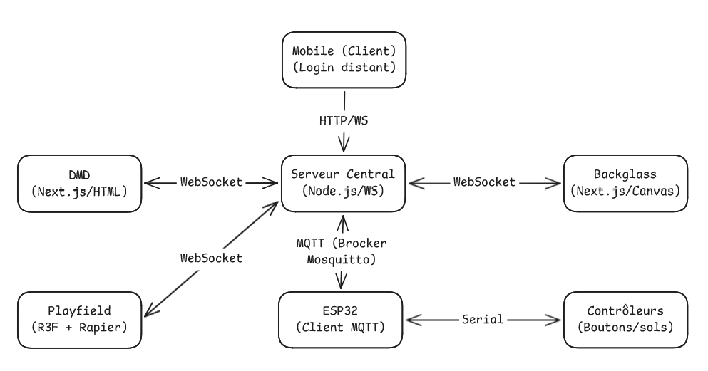

# Cahier des charges Technique pour le projet de Pinball

**Auteur**: [Adrien Allard, Stéphane Descarpentries]


---

## **Vision**

Ce projet a pour ambition de recréer l’expérience d’un flipper physique à travers une architecture web moderne, distribuée et interactive.

L’objectif n’est pas seulement de reproduire un jeu, mais de concevoir un système complet temps réel, combinant :

- Simulation physique 3D

- Communication distribuée (WebSockets + MQTT)

- Intégration IoT

- Expérience utilisateur immersive

Le projet vise à démontrer la capacité à concevoir une architecture logicielle complexe inspirée d’un système réel (flipper mécanique) tout en exploitant les technologies web contemporaines.

Ce projet est réalisé dans le cadre validation de la troisième année de _Bachelor Développeur Web_ à HETIC, et s’inscrit dans une démarche d’apprentissage par la pratique, en appliquant les concepts de développement web, d’architecture logicielle et de communication temps réel.

---

## **Objectifs et perimetre**

### Objectifs 
1. Créer un pinball 3D avec pour objectif d'avoir un jeu fonctionnel et agréable à jouer.
2. Pouvoir controller des elements du jeu via des boutons physiques (ESP32).
3. Avoir un écran pour l'affichage du score et des informations du jeu.
4. Avoir un système de score et de vies.
5. Avoir un système de sauvegarde de la partie.

### Non-objectifs 
1. Pas de bot contre joueur.
2. Pas d'éditeur de pinball.

### Personas 

**Stéphanie**, 48 ans, passionnée de flipper, cherche à retrouver les sensations de son enfance avec un jeu moderne et personnalisable.

---

## **Use cases**

Cette partie décrit les différents cas d’utilisation du projet de Pinball, en mettant en évidence les interactions entre les utilisateurs et le système.

### 1. Gestion des Comptes et Statistiques

#### UCA1 : Création de compte / Connexion

Acteurs : Joueur (Interface Web)
Préconditions : Base de données accessible.

Scénario nominal :

- Le joueur saisit son pseudo, email et mot de passe.

- Le système vérifie l'unicité du pseudo/email.

- Le compte est créé et une session est ouverte.

- Le système initialise les statistiques à zéro (parties jouées, score max, temps total).

#### UCA2 : Consultation des Statistiques et Historique

Acteurs : Joueur
Préconditions : Joueur connecté.

Scénario nominal :

- Le joueur accède à son profil.

- Le système récupère l'historique des 10 dernières parties.

- Le système calcule et affiche : Score moyen, Score maximum, Temps de jeu cumulé.

- Le système affiche le classement (Leaderboard) mondial.

### 2. Gameplay & Interactions (Playfield)

#### UCJ1 : Lancer une partie

Acteurs : Joueur (via clavier ou ESP32)
Préconditions : Serveur WS démarré, Playfield connecté, Crédit ≥ 1 OU mode Free Play actif.

Scénario nominal :

- Le joueur appuie sur le bouton Start (Touche D ou Bouton IoT).

- Le système réinitialise le score à 0.

- Le nombre de billes est initialisé (ex : 3).

- La bille est placée dans le lanceur via le moteur physique (Cannon.js).

- Le Backglass affiche le score initial et le pseudo du joueur.

- Le DMD affiche "GAME START".

Extensions :

1a. Partie déjà en cours → Le système ignore la commande ou demande une confirmation de "Reset".

#### UCJ2 : Actionner les batteurs (Flippers)

Acteurs : Joueur (via clavier ou ESP32)
Préconditions : Partie en cours.

Scénario nominal :

- Le joueur appuie/relâche la touche Gauche (X) ou Droite (C).

- Le signal est reçu par le Playfield via Socket.io.

- Le moteur physique applique une rotation angulaire immédiate au batteur 3D.

- Le serveur envoie une commande à l'IoT (Relais) pour faire claquer le solénoïde physique correspondant.

#### UCJ3 : Secouer la table (Nudge / Tilt)

Acteurs : Joueur
Préconditions : Partie en cours, bille sur le plateau.

Scénario nominal :

- Le joueur utilise une commande de secousse (Touche espace ou accéléromètre IoT).

- Le Playfield applique une force latérale impulsionnelle à la bille.

- Le système incrémente un "compteur de secousses".

Extensions :

1a. Seuil de secousse dépassé → Le système active l'état TILT.

2a. État TILT → Les flippers deviennent inactifs, le DMD affiche "TILT !", la bille tombe.

### 3. Logique de Score et Feedback (Système)

#### UCS1 : Détection de collision (Scoring)

Acteurs : Système (Moteur physique)
Préconditions : Bille en mouvement.

Scénario nominal :

- La bille entre en collision avec un objet (Bumper, Slingshot).

- Le moteur physique calcule le rebond.

- Le Playfield envoie l'événement collision_event au serveur avec l'ID de l'objet.

- Le serveur ajoute les points au score total.

- Le serveur ordonne au Backglass de mettre à jour l'affichage.

- Le serveur ordonne à l'IoT de faire claquer le solénoïde de l'objet touché pour un retour haptique.

#### UCS2 : Perte de bille et Fin de partie

Acteurs : Système
Préconditions : Partie en cours.

Scénario nominal :

- La bille entre en collision avec la zone "Outhole" (bas du plateau).

- Le système décrémente le nombre de billes restantes.

- Si billes > 0 : Une nouvelle bille est générée dans le lanceur.

- Si billes = 0 :
  - Le DMD affiche "GAME OVER".

  - Le système déclenche l'UCA3 (Enregistrement du score).

#### UCS3 : Enregistrement et Archivage du Score

Acteurs : Système / Base de données
Préconditions : Fin de partie détectée, Joueur connecté.

Scénario nominal :

- Le serveur récupère le score final et l'ID du joueur.

- Le système enregistre la partie en base de données (Score, Date, Durée).

- Le système vérifie si c'est un nouveau "High Score" personnel.

- Le Backglass affiche une animation spéciale si le record est battu.

- Le DMD affiche le classement mis à jour.

#### UCS5 : Validation anti-triche

Acteurs : Système
Scénario :

- À la fin de la partie, le serveur compare le score reçu avec la durée de la partie et le nombre de collisions enregistrées.

- Si le score est cohérent, il est validé en base de données.

- Sinon, le score est rejeté et l'admin est alerté.

### 4. Infrastructure IoT & Communication (MQTT/WebSockets)

#### UCI1 : Initialisation et Connexion IoT

Acteurs : Système IoT (ESP32), Serveur (Broker MQTT)
Préconditions : Firmware flashé sur l'ESP32, Broker MQTT lancé (ex: Mosquitto).

Scénario nominal :

- L'ESP32 démarre et se connecte au Wi-Fi.

- L'ESP32 s'enregistre auprès du Broker MQTT (Client ID unique).

- L'ESP32 "souscrit" (Subscribe) aux topics de feedback (ex: flipper/solenoids/#).

- Le Playfield (via le serveur Node.js) confirme la connexion.

- Le DMD affiche un pictogramme "IoT Ready".

Extensions :

1a. Échec de connexion Wi-Fi → L'ESP32 passe en mode "Keyboard Fallback" (émulation clavier USB).

#### UCI2 : Transmission d'Input (Boutons vers Jeu)

Acteurs : Joueur (Boutons physiques), Système IoT
Préconditions : Partie lancée, Connexion MQTT active.

Scénario nominal :

- Le joueur appuie sur un bouton physique (ex: Flipper Droit).

- L'ESP32 détecte le changement d'état (Interrupt) sur le PIN GPIO.

- L'ESP32 publie (Publish) un message sur le topic flipper/input/right.

- Le serveur Node.js reçoit le message et le relaie au Playfield via WebSockets.

- Le Playfield active le batteur 3D.

#### UCI4 : Appairage des écrans

Acteurs : Système (Navigateurs)

Scénario :

- Chaque écran se connecte au serveur Socket.io.

- Le serveur identifie quel client est le "DMD", lequel est le "Backglass".

- Le serveur confirme que le "trio" est complet avant de permettre le lancement d'une partie.

#### UCI3 : Commande de Feedback Haptique (Jeu vers Solénoïdes)

Acteurs : Playfield, Système IoT (Relais/Solénoïdes)
Préconditions : Collision détectée dans le moteur physique.

Scénario nominal :

- Une collision est détectée sur un "Bumper" dans Three.js.

- Le Playfield envoie l'ID du bumper au serveur.

- Le serveur publie un message MQTT sur le topic flipper/output/solenoid/3.

- L'ESP32 reçoit le message, active le relais correspondant pendant 50ms.

- Le solénoïde physique "claque", créant une vibration et un bruit réel.

### 5. Administration et Maintenance

#### UCAD1 : Monitoring du système (Dashboard Admin)

Acteurs : Administrateur
Préconditions : Accès à l'interface de gestion.

Scénario nominal :

- L'admin se connecte au dashboard.

- Le système affiche l'état de santé de chaque module (Playfield: OK, Backglass: OK, IoT: CONNECTED).

- L'admin peut tester un solénoïde à distance en cliquant sur un bouton virtuel.

- Le système affiche le nombre de messages MQTT/WebSockets par seconde (Load balancing).

#### UCAD2 : Ajout de crédit virtuel (Admin / Free Play)

Acteurs : Administrateur
Préconditions : Accès au Dashboard Admin.

Scénario nominal :

- L’admin clique sur "Add Credit".

- Le système ajoute un crédits à l'utilisateur.

Extensions :

1a. Mode Free Play activé → Aucun crédit requis pour démarrer.

### 6. Gestion des Crédits (Arcade & Web)

#### UCC1 : Insertion d’une pièce physique

Acteurs : Joueur (borne physique), ESP32
Préconditions : Connexion MQTT active, système en état IDLE ou GAME_OVER.

Scénario nominal :

- Le joueur insère une pièce dans le monnayeur (ou l'appuie d'un bouton).

- L’ESP32 détecte l’impulsion électrique sur le GPIO.

- L’ESP32 publie un message MQTT sur le topic flipper/input/coin.

- Le serveur reçoit le message.

- Le nombre de crédits disponibles est incrémenté.

- Le Backglass met à jour l’affichage "CREDITS : X".

- Le DMD affiche "CREDIT ADDED".

Extensions :

1a. Broker indisponible → L’ESP32 log l’erreur et ignore l’événement.
2a. Partie en cours → Le crédit est ajouté pour la prochaine partie.

---

## **Architecture technique**

<!-- link image -->

### **Cœur du Système**

*   **Serveur Central (Node.js/WS)** : Il agit comme le "chef d'orchestre" et le pont (bridge) entre tous les composants. Il centralise les événements et synchronise les applications en temps réel.

### **Interfaces Utilisateurs (Frontend)**
**Écrans de jeu (via WebSockets)** :
*   **Playfield (R3F + Rapier)** : Gère la simulation physique 3D et le rendu de la table.
*   **Backglass (Next.js/Canvas)** : Affiche le score et les animations thématiques.
*   **DMD (Next.js/HTML)** : Affiche les messages textuels et les scores en style rétro**Accès Distant (via HTTP/WS)** :
*   **Mobile (Client)** : Permet l'authentification et le login à distance pour démarrer la partie.

### **Partie Matérielle (IoT)**

**Communication Réseau (via MQTT / Broker Mosquitto)** :
*   L'ESP32 reçoit et envoie les données de contrôle au serveur central avec une latence minimale.

**Contrôle Physique (via Liaison Serial)** :
*   L'ESP32 est relié directement aux Contrôleurs pour détecter l'appui sur les boutons (flippers, start) et actionner les solénoïdes pour le retour haptique.

## **Diagrammes UML**


---

## **Stack technique**

| Composant               | Techno                                 | Justification                                                                                                                    |
| ----------------------- | -------------------------------------- | -------------------------------------------------------------------------------------------------------------------------------- |
| **Framework Principal** | **Next.js 16+** (App Router)           | Centralise le Frontend, l'API et le SSR. Idéal pour la gestion des comptes et le SEO du projet.                                  |
| **Playfield (3D)**      | **Three.js + React Three Fiber (R3F)** | Intégration déclarative de la 3D dans React. Facilite la gestion des composants (Bumper.js, Ball.js).                            |
| **Moteur Physique**     | **Rapier.js (@react-three/rapier)**    | Moteur haute performance (WASM). Meilleure gestion des collisions continues (CCD) pour éviter que la bille ne traverse les murs. |
| **Base de données**     | **PostgreSQL + Prisma or Drizzle**     | Base relationnelle robuste pour les scores, les stats et les relations utilisateurs. L'ORM facilite les requêtes en TypeScript.  |
| **Temps Réel (Web)**    | **Socket.io**                          | Communication bidirectionnelle à faible latence entre le Playfield, le Backglass et le DMD.                                      |
| **Communication IoT**   | **MQTT (Mosquitto)**                   | Protocole standard IoT "Publish/Subscribe". Ultra-léger, parfait pour la réactivité des solénoïdes.                              |
| **Authentification**    | **NextAuth.js (Auth.js)**              | Gestion sécurisée des sessions, connexion via Google/GitHub ou Email/Password.                                                   |
| **Gestion d'État**      | **Zustand**                            | Pour synchroniser l'état du score et du jeu entre les composants React sans la complexité de Redux.                              |
| **Styles / UI**         | **Tailwind CSS + Shadcn/UI**           | Développement rapide d'interfaces modernes et responsives pour le Dashboard et le Backglass.                                     |

---

## **Risques et contraintes**

## **Risques et contraintes**

Les risques et contraintes principaux de l'intégration de ce projet seront tant dévéloppement web que physique (Intéractiuon avec le matériel)

### Les Risques :
#### Risque Physique (matériel)

| Risque | Probabilité | Impact | Mitigation |
|--------|-------------|--------|------------|
|Accès à la machine pour les tests | Elevée | Fort | Planifier des sessions de test, préparer une checklist, créer un mode simulation (MQTT events mock) pour avancer sans la machine.
| Surchage des solénoïdes | Moyenne | Critique |Mettre en place un arrêt des solénoïdes après x temps |
| Connectique instable (vibrations ou et faux contacts) | Moyenne | faible | En cas de beug vérifier si le problème n'est pas côté materiel |
| Bruits/parasites | Moyenne | Fort | Eviter les sons de collisions trop forts ou les filtrés pour éviter qu'ils ne soient pas confondus à de la triche (neudge) |


#### Risuques Virtuel ( côté code )

|Risque | Probabilité | Impact | Mitigation |
|-------|-------------|--------|------------|
| 3D (Colission, Physique, réactivité) | élevée | Critique | Fixed timestep (ex 60Hz), CCD sur la balle, colliders simples/épais (pas mesh high-poly), réglages friction/restitution, debug colliders. | 
| Performances WebGL insuffisantes | Moyenne | Fort | Optimiser scène : instancing, limiter lights/ombres, textures compressées, LOD, réduire re-renders (selectors Zustand), profiling |
| Désynchronisation entre Playfield, Backglass et DMD | Moyenne | Critique | Définir une source de vérité (serveur ou “game state” central). Envoyer des events (pas des états “calculés partout”). Ajouter un eventId + timestamp + version de state. Prévoir “state snapshot” périodique pour resync.
| Double déclenchement (rebond électrique / bounce) sur boutons | Elevée | Critique | Garder l’input “local-first” côté Playfield : l’action visuelle/physique part immédiatement puis on réconcilie via events. Optimiser payloads MQTT (petits messages). WebSocket/MQTT sur LAN, éviter surcharges. |
| State management instable (Zustand + flux MQTT) | Moyenne | Moyenne | Séparer state temps réel (events, score, flags) et state UI. Utiliser selectors Zustand + shallow compare. Bufferiser certains events (batch).|
| Reconnexion Wifi mal gérée | Elevée | Fort | Reconnect + backoff, handshake, demander snapshot, mode “degraded/offline”, timeouts + retry contrôlés. |

#### Autres risques

|Risque | Probabilité | Impact | Mitigation |
|-------|-------------|--------|------------|
| Intégration IoT “trop tard” → démo cassée | Elevée | Critique | Intégrer IoT plus tôt possible en version minimale : recevoir X/C/D/F et déclencher 1 solénoïde “dummy”. Itérer ensuite.

### Les contraintes :

#### Contraintes physiques et matérielles :

- Matériel existant non modifiable (ou modifications minimales)

- L’intégration ne pas dégrader le flipper d’origine

- Le temps de test sur machine physique est contraint (cours, disponibilités, transport).

#### Contraintes logicielles (3D + apps) : 
- Réactivité ressentie : actions (flippers/nudge) doivent être visibles immédiatement (latence faible)
- Playfield / Backglass / DMD doivent rester cohérents via une source de vérité et des events.
- Delai : 6 semaines environs
- Equipe : 4 personnes

---

## **Conventions equipe**
Afin de garantir une base de code saine et une collaboration fluide, l'équipe s'engage à respecter les règles suivantes :

### **Gestion des Branches**

Le nommage des branches suit la structure : `type/id-issue-slug` (ex: `feature/42-physics-engine`).

*   **Types autorisés** : `main` (production), `feature/` (nouvelle fonctionnalité), `bugfix/` (correction), `hotfix/` (urgence), `release/` (préparation version), ou `docs/` (maintenance/docs).
*   **Règles de formatage** : Minuscules uniquement, chiffres et tirets autorisés. Pas de tirets ou points consécutifs, ni au début/fin du nom.

**Workflow des branches**

Nous utilisons une branche de transition pour garantir la stabilité du projet :

*   **Branche `develop`** : C'est la branche d'intégration principale. Toutes les fonctionnalités y sont regroupées pour les tests.
*   **Branche `main`** : Branche de production. On n'y merge `develop` qu'après s'être assuré de la stabilité globale du projet.
*   **Cycle de vie** : `feature/*` ➔ merge dans `develop` ➔ tests de stabilité ➔ merge final dans `main`.

### **Convention des Commits**

Nous utilisons les **Conventional Commits** pour faciliter la lecture de l'historique :

*   **Format** : `<type>: <description>` (ex: `feat: add rapier collision detection`).
*   **Types principaux** : `feat` (nouveau), `fix` (correctif), `docs` (documentation), `style` (formatage), `refactor` (code), `test` (tests).

### **Workflow de Pull Request (PR)**

*   **Cible par défaut** : Toute modification du code doit passer par une PR ciblée vers la branche `develop`.
*   **Validation** : Chaque PR nécessite au minimum **1 review approuvée**.
*   **Pair Review** : Pour favoriser la montée en compétence, les PR complexes sont revues en direct lors des Daily meetings.

### **Gestion des Conflits**

*   **Prévention** : Avant de soumettre une PR, l'auteur doit effectuer un `rebase` sur `develop` (et non directement sur `main`) pour intégrer les derniers changements des autres membres.
*   **Résolution** : Les conflits critiques sont résolus en binôme (auteur + reviewer) pour garantir l'intégrité du code fusionné.
---

## **Roadmap et questions ouvertes**

## **Structure des données MQTT**

Nous utilisons deux topics distincts pour séparer les flux entrants (capteurs) des flux sortants (actionneurs haptiques).

### **1. Flux Entrant (ESP32 → Serveur)**

*   **Topic** : `pinball/input/state`
*   **Description** : Ce JSON est envoyé par l'ESP32 dès qu'un état change ou de manière périodique pour les données analogiques (Nudge/Plunger).

```json
{
  "timestamp": 1708182000,
  "buttons": {
    "left_flipper": false,
    "right_flipper": false,
    "start": false,
    "coin_slot": false,
    "launch_ball": false
  },
  "analog": {
    "plunger": 0.0,
    "nudge": {
      "x": 0.02,
      "y": -0.01,
      "z": 9.81
    }
  }
}
```

*   **`coin_slot`** : État du monnayeur (Pièce entrée).
*   **`nudge`** : Données de l'accéléromètre (X, Y, Z) permettant au moteur Rapier de simuler l'inclinaison ou la secousse de la table.

### **2. Flux Sortant (Serveur → ESP32)**

*   **Topic** : `pinball/output/actuators`
*   **Description** : Ce JSON est envoyé par le serveur (déclenché par la logique du Playfield) pour piloter les relais des 10 solénoïdes listés dans la documentation.

```json
{
  "timestamp": 1708182500,
  "solenoids": {
    "back_left": 0,
    "back_center": 0,
    "back_right": 0,
    "middle_left": 40,
    "middle_center": 0,
    "middle_right": 0,
    "left_slingshot": 25,
    "right_slingshot": 0,
    "left_flipper": 0,
    "right_flipper": 0
  }
}
```